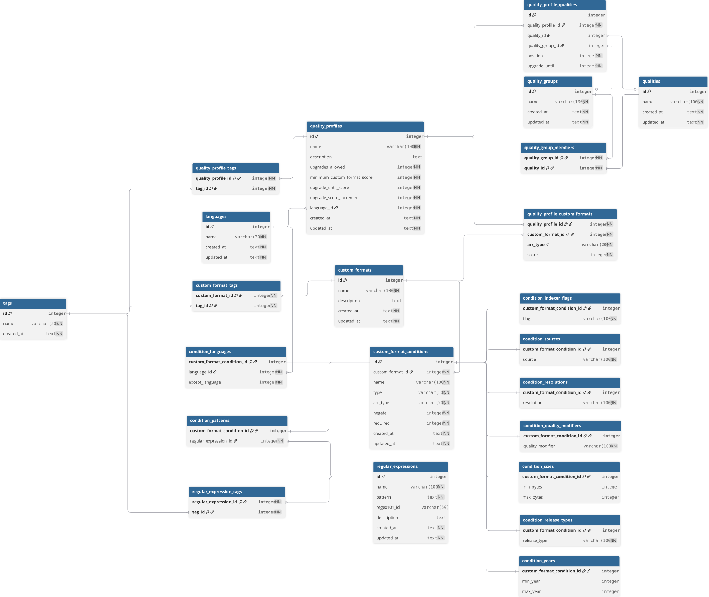

# Schema

This repository hosts the base schema applied to all
[Profilarr Compliant Databases](https://dictionarry.dev/profilarr-setup/linking?section=the-open-standard)

  <picture>
    <source media="(prefers-color-scheme: dark)" srcset=".github/image/schema-dark.svg">
    <source media="(prefers-color-scheme: light)" srcset=".github/image/schema.svg">
    
  </picture>

Diagram is auto-generated from `ops/0.schema.sql` by the
`generate-schema-diagram` workflow. Do not edit the SVGs by hand.

## Documentation

- [Manifest Specification](docs/manifest.md) - Required manifest file format for
  all PCDs

## Contributing

Please read [CONTRIBUTING.md](CONTRIBUTING.md) before proposing changes. All
contributions must be discussed before submission.

## Changelog

See [CHANGELOG.md](CHANGELOG.md) for a list of changes.
